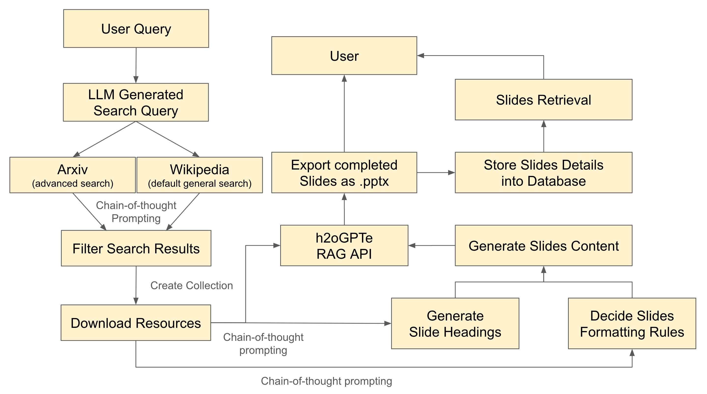

# DSA4213-Project Motivation

> *Have you ever imagined a world where you can generate a bundle of slides with just a single touch? Hooray! Say goodbye to tedious and time-consuming slide presentations. We're proud to introduce the DSA4213-Rojak Slides Generator, designed to help you quickly grasp the contents of various research papers or even just a general search.*

## Problem Statement
AI-driven tools like the PPT Generator are increasingly popular as they streamline the transformation of academic papers into engaging presentation slides, making communication more effective. This tool is ideal for academics, students, and professionals who frequently share research findings or data-heavy reports. The PPT Generator employs a large language model MixtralsAI to intelligently analyze and distill key information from texts. Then, leveraging the RAG (Retrieval-Augmented Generation) pipeline, it creatively designs slides that are not only informative but also visually appealing, effectively eliminating the manual labor typically involved in slide creation. 

## Project Description
---

---

The workflow is designed to optimize the creation of presentation slides from user queries. Firstly, users may enter his or her query, which is then processed by a Large Language Model (mixtral) to generate a refined search query. It's flexible for users to specify their query preference of source, where the tailored query is parsed to conduct a general search (Wikipedia), an advanced search (Arxiv) or both, leveraging chain-of-thought prompting for depth and precision. 

The refined user query will enhance the filtration process, which the document data is scrapped relevantly and accordingly, and they are then assembled into a collection. This collection is then analysed, info-extracted, context-reconstructed and applied to generate authoritative and accurate slides title and content. The heart of the system is the h2oGPTe RAG API, which synthesizes the downloaded resources to craft relevant headings and generate the slide content. Concurrently, the system decides on the formatting rules to ensure that the slides are not just informative but also visually engaging. 

Once the content is generated and formatted, it is available for users to download the completed slides as a .pptx file, and it is well-stored in a database for slides record retrieval. This seamless process, from query, data collection, slides generation, slides exportation, and slides past and current installment, epitomizes the potential of AI to revolutionize the way we prepare and consume information for academic and professional purposes. 

### Working Environments
Our working environment is basically Python, Python streamlit, PostgreSQL and Docker. 

### Backend Model Functionalities
Leveraging h2oGPTe as our client, our solution (in src) is mainly deployed in an Python environment and dockerised, consisting of the usage of: 
- [x] **easy deomonstration** of overall workflow using IPython notebook `SlideGenerator.ipynb`
- [x] **data scrapping and ingestion** with user topic input and preferred source
- [x] **keyword generation and user queries refinement** through Mixtral-v0.1 LLM
- [x] **generating slides** headings, contents and design layout 
- [x] **exporting** the slides in .pptx form
- [x] **database interactions** for session users and slides details via ***PostgreSQL***
- [x] cleaning **filepaths and caches** to guarantee application deployment

... while associating of the usage of: 

### Frontend Model Functionalities
- [x] enabling user **login and signup** to trace records of slides generated
- [x] allowing user **input (topic) and preferences** for model interactions
- [x] providing user **a tabular overview** of session generated slides history records
- [x] allowing user to **download or redownload** all the slides they have generated in that session
- [x] engaging user experience with **design preferences** by accessing the right upper corner button
- [x] **open to user feedbacks** in the right upper corner button

***Remark:*** *The IPython notebook* `SlideGenerator.ipynb` *is coded at an initial stage, where our search engines were Duckduckgo and Wikipedia. However, it came to our attention that the unstability of Duckduckgo may cause search error, and thus we switched from Duckduckgo, as early proposed in our project, to arxiv, associating with Wikipedia.*

## Step-by-Step Manual Guide
In your terminal, do the following steps sequentially: 

1. **Cloning GitHub repository**
```sh
git clone https://github.com/HY-sTeam/DSA4213-Project
cd </path/to/the/cloned/github/directory>
```
2. **Environment Configuration**
put all used environment variables here, u can always refer to sample.env for a list of relevant environment variables used in this project. 
```sh 
nano .env
```
3. **Initialize Docker Environment** 
note that it takes some time for the dockerised process to be well-built, around 1~3 minutes. 
```sh
docker-compose up --build
# alternatively: COMPOSE_DOCKER_CLI_BUILD=1 DOCKER_BUILDKIT=1 docker-compose build --no-cache docker-compose up
```


We can observe the interactions of frontend, backend and database via streamlit interface [left panel] and psql container ***Exec*** panel [right panel] simultaneously. 


4. **Insights from Browser**
Once it's done, copy `http://0.0.0.0:8501` to have a look on **streamlit interface**. 

5. **Association with psql container Exec**
	- on Docker App, click on the psql container, and click the Exec panel, then perform all query operations over there to see a change. 
	- switch to psql shell: `psql -U myuser -d mydatabase`
	- check database information: `mydatabase=# \conninfo`
	- check relational schema (3 relations:  Users, Slides and Temps): `mydatabase=# \d`
	- check each relation / perform query: `mydatabase=# SELECT * FROM <RELATION>;`
	- if you wish to quit accessing any query, ie `mydatabase=# SELECT * FROM Slides;`, type **q** to quit

6. **Service Termination** 
   on your keyboard, press Ctrl+C to quit (Mac OS environment) if you wish to do so. 

7. For more step-by-step guides, you would wish to referring to `details/README.md`. 
   - [x] quick glance on the backend model logic using python notebook demo.
   - [ ] test out individual components of `app.py` and other `pages/page.py` separately, you will need to construct your own psql container here, failing to do so may lead several errors (will be stated in `details/README.md`). 
   - [ ] test out individual components of `src/code.py`. 

## An Optimistics Team
	
Wish you a happy exploring! 🎉🎉🎉

We treasure and welcome any discussions and suggestions for future development of this project. You can always drop us an email to us by the right upper ... button >> Report A Bug in our application. 

If it's a happy Sunday, the person in charge will prolly refer you to [this song](https://youtu.be/fLexgOxsZu0) heiheihei.


Warmest Regards, 
DSA4213 Rojak Team
AY2324 SEM 2

Instructor: Dr. Vishal Sharma

Fellow Members: Sum Hung Yee, Soo Wen Qiao, Chua Yeong Hui, Wong Xin Ying, Ng Zheng Li, Ng Keen Yung

## Limitations and Potential Deployment
- Expanding our search engines from only arxiv and wikipedia to other possibilities, ie google-search
- Exploring other potential Large Language Models, ie OpenAI API, as stated in the Appendix of `SlidesGenerator.ipynb`
- Cloud database storage instead of session database storage, 
- Collecting more user query for configurations to refine our model training procedures, including: 
  - font and color preferences
  - slides content exceeding slide layout issue (currently we still require users to manually fix it)
  - slides length 
  - images illustrations
- Allowing non-registered people to generate slides but not storing their slides
  By default, we only allow registered people to generate slides and the slides are stored corresponding to the timestamp and users id. However, we also notice the potential to allow slides generation from both registered and non-registered people. One way that may tackle this is to: 
  - In `db_scripts/DDL.sql`, add new line: `INSERT Users VALUES (dsa4213@gmail.com, admin, 4213_RojaK);`
  - In `app/app.py`, config new condition: if login_click with no values, all user details will be set with the above entries

## Demonstration of App Functionalities using `.gif`
<!-- ### Highlights
<table>
	<tr>
		<th width="50%">
			<p><a title="show-whitespace"></a> Makes whitespace characters visible
			<p>
		<th width="50%">
			<p><a title="resolve-conflicts"></a> Adds one-click merge conflict fixers
			<p>
	<tr>
		<th width="50%">
			<p><a title="pr-base-commit"></a> Shows how far behind a PR head branch is + tells you its base commit
			<p>
		<th width="50%">
			<p><a title="conversation-activity-filter"></a> Lets you hide every event except comments or unresolved comments in issues and PRs
			<p>
	<tr>
		<th width="50%">
			<p><a title="status-subscription"></a> Lets you subscribe to opening/closing events of issues in one click
			<p>
		<th width="50%">
			<p><a title="default-branch-button"></a> Adds a link to the default branch on directory listings and files
			<p>
	<tr>
		<th width="50%">
			<p><a title="restore-file"></a> Adds a button to discard all the changes to a file in a PR
			<p>
		<th width="50%">
			<p><a title="select-notifications"></a> Select notifications by type and status
			<p>
</table> -->